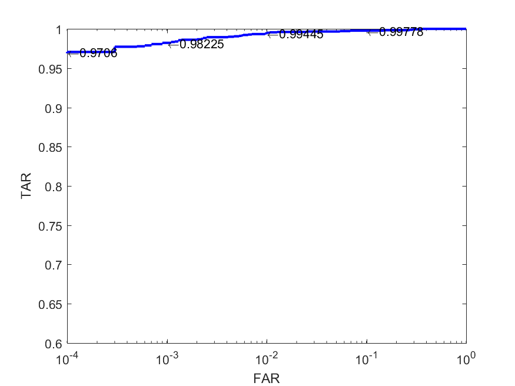

# Evaluation_IJBA

Those codes can be used to verify our single model's (ResNext152) performance on IJB-A with open and close protocols.

We release IJBA Evaluation codes on all 10 splits for face identification and verification tasks with Template Adaptation(**mean coding for video frames**). You can reproduce our single model's (ResNext 152 trained on our own face dataset illustrated by our arXiv paper: **"A Good Practice Towards Top Performance of Face Recognition: Transferred Deep Feature Fusion"**) results based on score matrix given by
the corresponding folders. The more detailed information about how to calculate scores, you can refer our [paper](https://arxiv.org/abs/1704.00438v2) . Due to the limitation of company, we can not provide ResNext 152 and SE-ResNext 101 models. We are very sorry. Moreover, all the features of IJBA data and Template Adaptation models will be released later(too many files need to be uploaded, so they will not come recently).

## How to use

Please download Evaluation_IJBA.zip to your local machine and unzip it.

In Evaluation_IJBA folder, there are three folders named **AllSplitEvaluationSearch, AllsplitEvaluationVerify and models** respectively. 

**AllSplitEvaluationSearch** folder includes evaluation codes for face identification task, all results will be stored in /models/_template_resnext/split**x**/Results_RSX152/ (where **x** means the number of split) 

**AllsplitEvaluationVerify** folder includes evaluation codes for face verification task, all results will be stored in 
/models/_template_resnext/split**x**/Results_RSX152/ (where **x** means the number of split) 

**models** folder includes all 10 split related files of IJB-A dataset

## Requirements
Matlab R2016b or later version.

## ROC curve for split 1

If those codes can help your work, please cite our paper **"A Good Practice Towards Top Performance of Face Recognition: Transferred Deep Feature Fusion"**. We are appreciate for your citation.

@article{xiong2017good,
  title={A good practice towards top performance of face recognition: Transferred deep feature fusion},
  author={Xiong, Lin and Karlekar, Jayashree and Zhao, Jian and Cheng, Yi and Xu, Yan and Feng, Jiashi and Pranata, Sugiri and Shen, Shengmei},
  journal={arXiv preprint arXiv:1704.00438},
  year={2017}
}

Xiong, Lin, Jayashree Karlekar, Jian Zhao, Yi Cheng, Yan Xu, Jiashi Feng, Sugiri Pranata, and Shengmei Shen. "A good practice towards top performance of face recognition: Transferred deep feature fusion." arXiv preprint arXiv:1704.00438 (2017).
